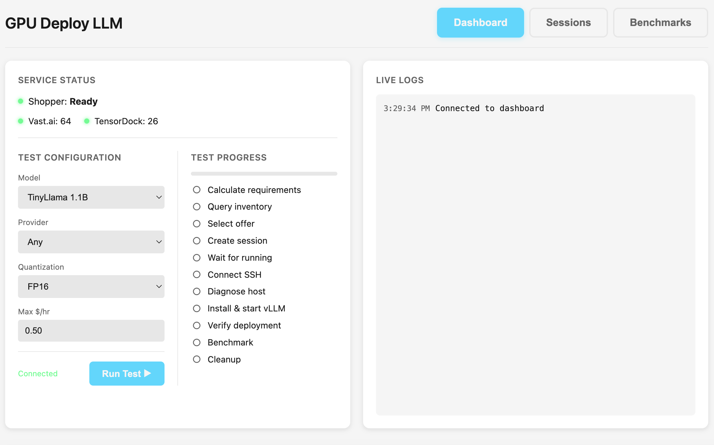

# GPU Deploy LLM

A CLI tool and web dashboard for deploying LLMs on cloud GPUs (Vast.ai, TensorDock) with automated provisioning, health checking, and benchmarking.



## Features

- **Multi-Provider Support**: Deploy to Vast.ai and TensorDock with unified API
- **Automated Deployment**: Full pipeline from GPU selection to running inference endpoint
- **Real-time Dashboard**: WebSocket-powered UI with live logs and progress tracking
- **Health Monitoring**: GPU status, container health, model loading verification
- **Benchmarking**: Measure tokens/sec, time-to-first-token, and cost efficiency
- **Secure by Default**: SSH keys in memory only, API keys via environment variables

## How It Works

1. **Query Inventory** - Find available GPU offers matching your requirements (VRAM, price, provider)
2. **Create Session** - Provision a cloud GPU instance with SSH access
3. **Deploy vLLM** - Install and start vLLM server (Docker or pip mode)
4. **Verify & Benchmark** - Run health checks and performance tests
5. **Cleanup** - Signal completion and release resources

## Installation

```bash
# Clone the repository
git clone https://github.com/your-org/gpu-deploy-llm.git
cd gpu-deploy-llm

# Create virtual environment
python -m venv .venv
source .venv/bin/activate

# Install dependencies
pip install -e .
```

## Requirements

- Python 3.11+
- Running [cloud-gpu-shopper](https://github.com/your-org/cloud-gpu-shopper) instance (default: http://localhost:8080)

## Usage

### Web Dashboard

```bash
# Start the dashboard (opens browser automatically)
python -c "from gpu_deploy_llm.web.server import run_server; run_server(port=8888)"
```

The dashboard provides:
- **Service Status**: Connection to shopper API and available GPU inventory
- **Test Configuration**: Select model, provider, quantization, and max price
- **Test Progress**: Real-time step-by-step deployment progress
- **Live Logs**: Streaming logs from all deployment stages

### CLI

```bash
# Run a deployment test
gpu-deploy-llm test --model "TinyLlama/TinyLlama-1.1B-Chat-v1.0" --max-price 0.50

# List available GPU offers
gpu-deploy-llm inventory --min-vram 24 --provider vastai
```

## Architecture

```
gpu_deploy_llm/
├── client/          # Shopper API client (REST + models)
│   ├── shopper.py   # ShopperClient for Vast.ai/TensorDock API
│   └── models.py    # Session, GPUOffer, etc. data models
├── deploy/          # Deployment logic
│   ├── vllm.py      # vLLM deployment (Docker & pip modes)
│   ├── health.py    # Health checking & verification
│   └── benchmark.py # Performance benchmarking
├── ssh/             # SSH connection management
│   └── connection.py # Async SSH with secure key handling
└── web/             # Web dashboard
    ├── server.py    # FastAPI + WebSocket server
    └── static/      # Dashboard HTML/JS
```

## Supported Models

The dashboard includes presets for popular models:
- TinyLlama 1.1B (testing)
- Llama 2 7B / 13B
- Mistral 7B
- Mixtral 8x7B
- Llama 3 8B / 70B
- And more...

## Configuration

| Environment Variable | Default | Description |
|---------------------|---------|-------------|
| `SHOPPER_URL` | `http://localhost:8080` | Cloud GPU Shopper API URL |
| `VLLM_API_KEY` | (auto-generated) | API key for vLLM server |

## Security

- SSH private keys are stored in memory and temporary files (0600 permissions) only
- API keys are passed via environment variables, never command-line arguments
- Docker containers run as non-root user (1000:1000)
- All user inputs are escaped with `shlex.quote()` to prevent command injection

## License

MIT
